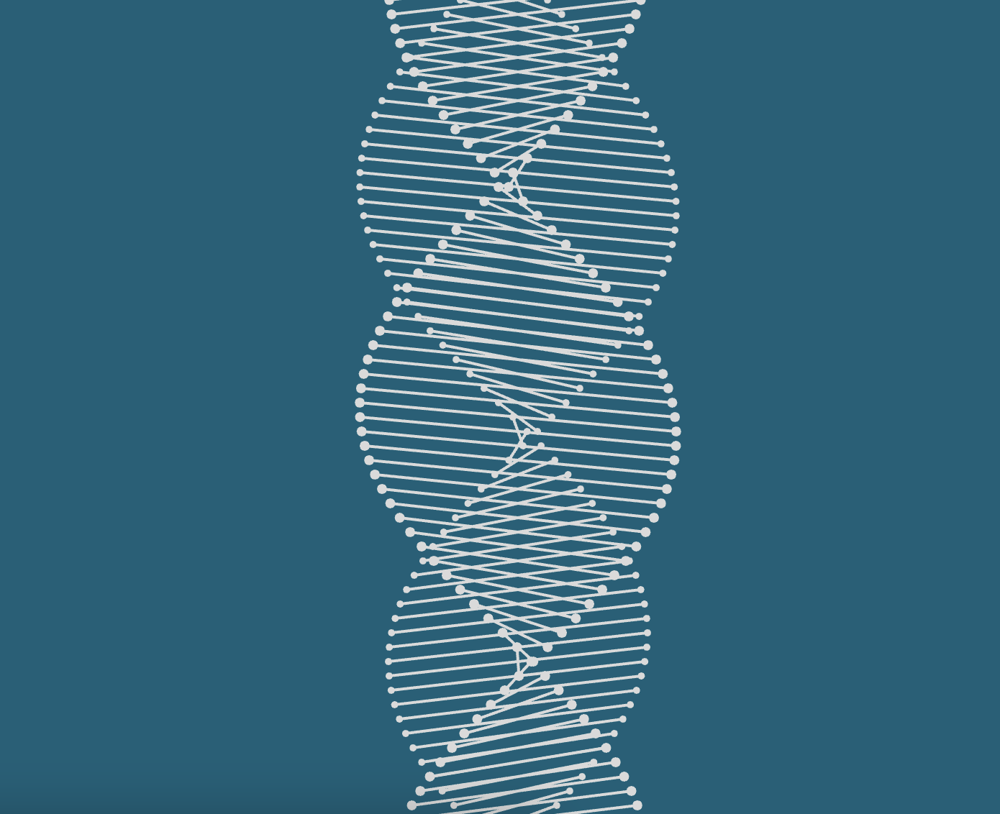

Hey everyone! 🌟

I just wrapped up another fun animation project that combines math and art to create some stunning visuals. This time, it's all about dynamic parametric patterns. Check out the code below, and watch as simple math functions bring beautiful patterns to life.



To see the animation working in real time follow <a href="https://editor.p5js.org/zoyron/full/BySpaNTvb" target="_blank">this link</a>.

> Note: This blog is targetted towards people who're beginners and just know very little JavaScript.

## The Math Behind the Magic


- **Trigonometry**: Sine and cosine functions are used to calculate the x and y coordinates of the points, creating smooth oscillating motions.

- **Parametric Equations**: These are used to generate coordinates based on a parameter t, allowing the creation of dynamic and animated patterns.

- **Incremental Time Variable**: The variable t is incremented over time, driving the animation and creating continuous movement.

## Let's Code

First off, we're using p5.js here, which is a super fun JavaScript library for creative coding. Instead of writing p5js code locally, I prefer their online editor which you can also use use <a href="https://editor.p5js.org/" target="_blank">here</a>. Make sure you're writing code in that editor only.

Now that we're done with the math behind it, let's get our hands dirty with the coding part.

### Setup and initialization
First, we set up our canvas and initialize the time variable *t*:
```javascript
function setup(){
  createCanvas(windowWidth, windowHeight);
}
let t = 0;
```
### Drawing the Animation
Next, in the draw function, we clear the canvas, translate the origin, and draw lines and circles based on the parameter t:
```javascript
function draw(){
  background('#0a6078'); // Clear the canvas with a background color
  translate(width / 2, -5 * height); // Move the origin to the center

  for(let i = 0; i < 500; i++){
    strokeWeight(2);
    fill('#dadada');
    stroke('#dadada');

    // Draw lines and circles based on trigonometric functions
    line(xa1(t + i), ya1(t + i), xa2(t + i) + 20, ya2(t + i) + 20);
    circle(xa1(t + i), ya1(t + i), 5);
    circle(xa2(t + i) + 20, ya2(t + i) + 20, 5);
    
    line(x1(t + i), y1(t + i), x2(t + i) + 20, y2(t + i) + 20);
    circle(x1(t + i), y1(t + i), 3);
    circle(x2(t + i) + 20, y2(t + i) + 20, 3);
  }

  t += 0.075; // Increment the time variable
}
```
- **Translate**: Moves the origin to the center of the canvas.
- **Loop**: Runs 500 times per frame to draw multiple lines and circles.
- **Time Increment**: t is incremented slightly each frame to animate the patterns.

### The Functions

These functions calculate the coordinates for the lines and circles using trigonometric functions:
```javascript
// Function to calculate x-coordinate of the first endpoint based on parameter t
function x1(t){
  return sin(t / 10) * 100;
}

// Function to calculate y-coordinate of the first endpoint based on parameter t
function y1(t){
  return (t / 10) * 100;
}

// Function to calculate x-coordinate of the second endpoint based on parameter t
function x2(t){
  return -sin(t / 10) * 100;
}

// Function to calculate y-coordinate of the second endpoint based on parameter t
function y2(t){
  return (t / 10) * 100;
}

// Function to calculate x-coordinate of another pattern's first endpoint based on parameter t
function xa1(t){
  return -cos(t / 10) * 100;
}

// Function to calculate y-coordinate of another pattern's first endpoint based on parameter t
function ya1(t){
  return (t / 10) * 100;
}

// Function to calculate x-coordinate of another pattern's second endpoint based on parameter t
function xa2(t){
  return cos(t / 10) * 100;
}

// Function to calculate y-coordinate of another pattern's second endpoint based on parameter t
function ya2(t){
  return (t / 10) * 100;
}

// Function to calculate x-coordinate of yet another pattern's first endpoint based on parameter t
function xb1(t){
  return -((cos(t / 10) + sin(t / 10))) * 100;
}

// Function to calculate y-coordinate of yet another pattern's first endpoint based on parameter t
function yb1(t){
  return (t / 10) * 100;
}

// Function to calculate x-coordinate of yet another pattern's second endpoint based on parameter t
function xb2(t){
  return ((cos(t / 10) + sin(t / 10))) * 100;
}

// Function to calculate y-coordinate of yet another pattern's second endpoint based on parameter t
function yb2(t){
  return (t / 10) * 100;
}
```
---

## Complete Code

If you’re having difficulties collecting the bits of code from the blog, here’s the entire code for the animation.

Just copy paste the following code into <a href="https://editor.p5js.org/" target="_blank">this editor</a> and you’re good to go.

To copy the entire code, open <a href="https://github.com/zoyron/p5js-experiments/blob/master/dna.js" target="_blank">this link</a>

---

## Conclusion

By using trigonometry and parametric equations, this code creates dynamic and mesmerizing patterns. It's a perfect example of how simple math can generate complex and beautiful visuals. 

Happy coding! 🌟✨

