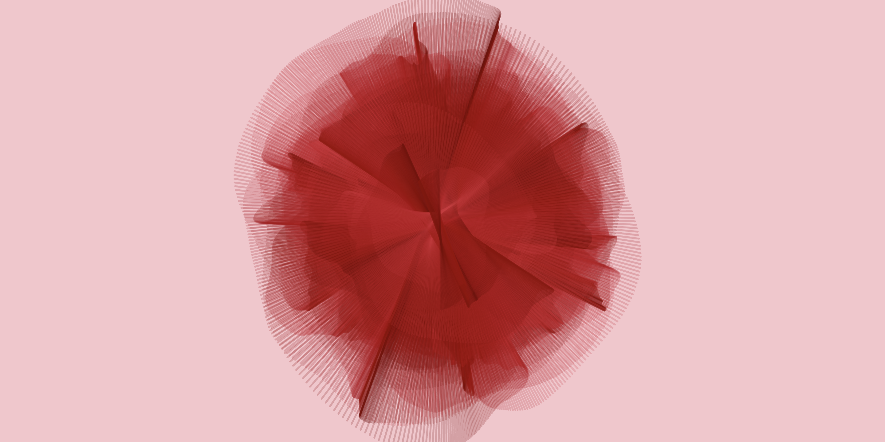

Hey everyone! 🌟

I just finished an animation project that combines math and art to create stunning visuals. Here's the final result of the animation.


To see the animation working in real time follow [this link](https://editor.p5js.org/zoyron/full/MLsIrRaWm)

> Note: This blog is targetted towards people who're beginners and just know very little JavaScript.

## What's Happening?
The animation draws lines that radiate from the center of the canvas, creating beautiful and fluid patterns. The lines rotate and grow, giving the appearance of a dynamic, evolving artwork.

Here’s a quick rundown of how it works and the math behind it.

### The Math Behind the Magic
- **Perlin Noise**: This is used to generate smooth, random changes in the radius and angle of the lines. Perlin noise helps create organic, flowing movements.

- **Trigonometry**: Sine and cosine functions calculate the positions of the endpoints of each line based on the angle and radius, ensuring the lines form a circular pattern.

- **Angle Wrapping**: Keeps the angles within the 0-360 degree range to maintain a smooth rotation.

- **Dynamic Coloring**: The stroke color gradually shifts, adding a subtle gradient effect that enhances the visual appeal.

## Let's code

Now that we're done with the math behind it, let's get our hand dirty with the coding part.
> Note: since we're using a special javascript library, you'd have to use [this editor](https://editor.p5js.org/). Setting up local environment for beginners could be a hassle so we will rely on the online editor for now.

### Setup and Initialization
First, we set up our canvas and initialize some variables:
```javascript
let angleNoise, radiusNoise;
let xNoise, yNoise;
let angle = -90;
let radius = 0;
let strokeCol = 255;
let strokeChange = -1;

function setup() {
  createCanvas(windowWidth, windowHeight);
  background("#f7c5cc");
  noFill();
  angleNoise = random(10);
  radiusNoise = random(10);
  xNoise = random(10);
  yNoise = random(10);
}
```
- **Canvas Setup**: createCanvas(windowWidth, windowHeight) sets the canvas size to the full window.
- **Background**: We set a soft pink background color (#f7c5cc).
- **Initial Random Values**: Random values for noise functions are initialized.

### Drawing the Animation
In the draw function, we translate the origin to the center of the canvas and draw lines that move and change based on Perlin noise.
```javascript
function draw() {
  translate(width / 2, height / 2);
  for (let i = 1; i <= 4; i++) {
    radiusNoise += 0.005;
    radius = noise(radiusNoise) * 450 + 1;
    angleNoise += 0.005;
    angle += noise(angleNoise) * 6 - 3;
    if (angle > 360) angle -= 360;
    if (angle < 0) angle += 360;
    xNoise += 0.01;
    yNoise += 0.01;
    let centreX = noise(xNoise) * 100 - 50;
    let centreY = noise(yNoise) * 100 - 50;
    let rad = radians(angle);
    let x1 = centreX + radius * cos(rad);
    let y1 = centreY + radius * sin(rad);
    let opprad = rad + radians(180);
    let x2 = centreX + radius * cos(opprad);
    let y2 = centreY + radius * sin(opprad);
    strokeCol += strokeChange;
    if (strokeCol > 255) strokeChange = -1;
    if (strokeCol < 150) strokeChange = 1;
    stroke(strokeCol - 41, strokeCol - 206, strokeCol - 194, 50);
    strokeWeight(3);
    line(x1, y1, x2, y2);
  }
}
```
- **Translate**: translate(width / 2, height / 2) moves the origin to the center of the canvas.
- **Loop**: The for loop runs four times per frame, drawing four lines.
- **Radius** and Angle Noise: radiusNoise and angleNoise are incremented and used to compute the radius and angle with Perlin noise.
- **Angle Wrapping**: Ensures the angle stays within 0-360 degrees.
- **Position Noise**: xNoise and yNoise create slight shifts in the center position using Perlin noise.
---
## Complete code
If you're having difficulties collecting the bits of code from the blog, here's the entire code for the animation.

Just copy paste this code into [this editor](https://editor.p5js.org/) and you're good to go.
```javascript
let angleNoise, radiusNoise;
let xNoise, yNoise;
let angle = -90;
let radius = 0;
let strokeCol = 255;
let strokeChange = -1;

function setup() {
  createCanvas(windowWidth, windowHeight);
  // frameRate(30);
  background("#f7c5cc");
  noFill();
  // angleMode(DEGREES);
  angleNoise = random(10);
  radiusNoise = random(10);
  xNoise = random(10);
  yNoise = random(10);
}

function draw() {
  translate(width / 2, height / 2);
  for (let i = 1; i <= 4; i++) {
    radiusNoise += 0.005;
    radius = noise(radiusNoise) * 450 + 1;
    angleNoise += 0.005;
    angle += noise(angleNoise) * 6 - 3;
    if (angle > 360) angle -= 360;
    if (angle < 0) angle += 360;
    xNoise += 0.01;
    yNoise += 0.01;
    let centreX = noise(xNoise) * 100 - 50;
    let centreY = noise(yNoise) * 100 - 50;
    let rad = radians(angle);
    let x1 = centreX + radius * cos(rad);
    let y1 = centreY + radius * sin(rad);
    let opprad = rad + radians(180);
    let x2 = centreX + radius * cos(opprad);
    let y2 = centreY + radius * sin(opprad);
    strokeCol += strokeChange;
    if (strokeCol > 255) strokeChange = -1;
    if (strokeCol < 150) strokeChange = 1;
    stroke(strokeCol - 41, strokeCol - 206, strokeCol - 194, 50);
    strokeWeight(3);
    line(x1, y1, x2, y2);
  }
}
```
## Conclusion

By combining Perlin noise and trigonometric functions, this code creates a beautiful, evolving pattern that looks like a blooming rose. The smooth transitions and organic movements make it a perfect example of how basic math can create stunning visual art. Happy coding! 🌹✨
